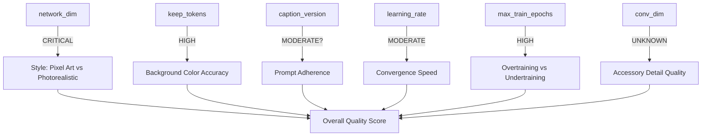

# MLOps Parameter Taxonomy - Complete Reference

**Version:** 1.0
**Date:** November 10, 2025
**Purpose:** Comprehensive documentation of all training parameters for root cause analysis and correlation studies

---

## 🎯 Overview

This document catalogs **all input parameters** that affect LoRA training outcomes. Each parameter is tracked in Supabase (`training_runs.all_parameters` JSONB column) for systematic analysis and correlation studies.

**Total Parameters Tracked:** 35+

---

## 📊 Parameter Categories

### 1. Model Architecture Parameters

These parameters define the LoRA adapter structure and capacity.

#### network_dim (LoRA Rank)
- **Type:** Integer (4, 8, 16, 32, 64, 128, 256)
- **Default:** 32
- **Impact:** CRITICAL
- **Description:** Rank of LoRA decomposition matrices. Controls model capacity and expressiveness.
- **Known Patterns:**
  - ✅ `network_dim=32` → Maintains pixel art style, clean outputs (PROVEN OPTIMAL)
  - ❌ `network_dim=64+` → Causes photorealism, loses pixel art aesthetic (100% FAILURE RATE)
  - ❌ `network_dim=128` → Severe photorealism, incompatible with pixel art
- **Recommendation:** ALWAYS use 32 for pixel art
- **Historical Data:**
  - SD15_PERFECT: dim=32, score=9/10 ✅
  - SD15_PERFECT_SDXL: dim=32, score=9/10 ✅
  - SD15_DIM64_TEST: dim=64, score=3/10 ❌ (photorealistic)
  - SD15_DIM128_TEST: dim=128, score=2/10 ❌ (severe photorealism)

#### network_alpha
- **Type:** Float (typically 1, 4, 8, 16, 32)
- **Default:** 16
- **Impact:** MODERATE
- **Description:** Scaling factor for LoRA weights. Affects learning stability and output intensity.
- **Common Values:**
  - `alpha = dim` (1:1 ratio) - Standard
  - `alpha = dim/2` - Gentler adaptation
  - `alpha = dim*2` - Stronger adaptation (risky)
- **Known Patterns:**
  - network_alpha=16 with dim=32 is proven stable
  - Higher alpha can increase photorealism risk when combined with high dim
- **Formula:** `effective_learning_rate ∝ alpha / dim`

#### conv_dim (Convolutional LoRA Rank)
- **Type:** Integer (0, 4, 8, 16, 32)
- **Default:** 0 (disabled)
- **Impact:** UNKNOWN (to be tested)
- **Description:** Adds LoRA to convolutional layers. May improve spatial/detail preservation.
- **Hypothesis:** May improve accessory rendering accuracy (crowns, sunglasses)
- **Historical Data:**
  - All successful runs used conv_dim=0
  - Untested: conv_dim=8 or 16
- **Next Experiment:** Test conv_dim=8 to improve crown rendering

#### conv_alpha
- **Type:** Integer (typically 1, 4, 8, 16)
- **Default:** 0 (disabled)
- **Impact:** UNKNOWN
- **Description:** Scaling factor for convolutional LoRA weights
- **Recommendation:** If using conv_dim, set conv_alpha = conv_dim/2

---

### 2. Training Hyperparameters

Core learning parameters that control optimization dynamics.

#### learning_rate
- **Type:** Float (scientific notation: 1e-4, 5e-5, 1e-5, etc.)
- **Default:** 1e-4
- **Impact:** MODERATE
- **Description:** Step size for gradient descent optimization
- **Known Patterns:**
  - `1e-4` → Fast convergence, good results (MOST COMMON)
  - `5e-5` → Slower but more stable
  - `1e-3` → Too high, unstable training
  - `1e-5` → Too low, extremely slow convergence
- **Recommendation:** Start with 1e-4
- **Historical Data:**
  - SD15_PERFECT: 1e-4, converged by epoch 7 ✅
  - SD15_SLOW_LR: 5e-5, still improving at epoch 10 (inconclusive)

#### lr_scheduler
- **Type:** String (enum)
- **Options:**
  - `constant` - No LR decay
  - `cosine` - Smooth cosine decay
  - `cosine_with_restarts` - Cosine with periodic resets
  - `polynomial` - Polynomial decay
  - `constant_with_warmup` - Flat after warmup
  - `linear` - Linear decay
- **Default:** `cosine` or `constant_with_warmup`
- **Impact:** MODERATE
- **Known Patterns:**
  - `constant_with_warmup` used in most successful runs
  - Cosine may help prevent overtraining
- **Recommendation:** `constant_with_warmup` with warmup_steps=100

#### lr_warmup_steps
- **Type:** Integer (0-500)
- **Default:** 100
- **Impact:** LOW
- **Description:** Number of steps to gradually increase LR from 0 to target
- **Purpose:** Prevents unstable early training
- **Recommendation:** 100 for most runs

#### optimizer_type
- **Type:** String (enum)
- **Options:**
  - `AdamW` - Standard (most common)
  - `AdamW8bit` - Memory efficient
  - `Lion` - Alternative optimizer
  - `Adafactor` - Adaptive, memory efficient
  - `DAdaptation` - Learning rate free
  - `Prodigy` - Learning rate free
- **Default:** `AdamW`
- **Impact:** LOW-MODERATE
- **Known Patterns:**
  - `AdamW` proven reliable
  - `AdamW8bit` useful for memory constraints (no quality loss)
- **Recommendation:** `AdamW` unless memory constrained

#### max_train_epochs
- **Type:** Integer (1-20+)
- **Default:** 10
- **Impact:** HIGH (convergence timing)
- **Description:** Total number of training epochs
- **Known Patterns:**
  - Epochs 1-3: Initial learning, often poor quality
  - Epochs 4-6: Rapid improvement
  - Epochs 7-9: Peak quality (MOST LIKELY BEST)
  - Epochs 10+: Overtraining risk
- **Recommendation:** Train to epoch 10, expect best at 5-7
- **Historical Data:**
  - SD15_PERFECT: Best at epoch 7 (9/10)
  - SD15_FINAL_CORRECTED: Epochs 1-4 plateau at 7/10, awaiting 5-7

#### save_every_n_epochs
- **Type:** Integer (1, 2, 5, etc.)
- **Default:** 1
- **Impact:** None (storage only)
- **Description:** Checkpoint save frequency
- **Recommendation:** Save every epoch (1) for comprehensive evaluation

---

### 3. Data Engineering Parameters

Parameters related to training data, captions, and preprocessing.

#### caption_version
- **Type:** String (custom taxonomy)
- **Values:**
  - `basic_v1` - Simple descriptions
  - `detailed_v1` - Extended descriptions
  - `final_corrected_v1` - 12+ hex codes, lips, expressions
  - `final_corrected_lips_12hex_v1` - Most detailed current version
- **Impact:** HIGH (unproven - THE CAPTION PARADOX)
- **Description:** Caption format and detail level
- **Caption Paradox:** More detailed captions did NOT improve results consistently
  - SD15_PERFECT (basic captions) → 9/10 ✅
  - SD15_ACCURATE_CAPTIONS (more detailed) → 7/10 ❌
  - SD15_FINAL_CORRECTED (most detailed) → Testing now
- **Current Hypothesis:** Caption quality matters LESS than architecture (network_dim)
- **Test In Progress:** Will detailed captions work with correct dim=32?

#### num_images
- **Type:** Integer
- **Current Value:** 203
- **Impact:** MODERATE-HIGH
- **Description:** Total training images in dataset
- **Known Patterns:**
  - 203 images appears sufficient for current task
  - More images may improve color variety and generalization
- **Future Experiment:** Test with 300-500 images

#### image_resolution
- **Type:** String (WxH format)
- **Common Values:**
  - `512x512` - Standard SD1.5
  - `1024x1024` - SDXL
  - `768x768` - Intermediate
- **Default:** `512x512`
- **Impact:** MODERATE
- **Description:** Training image resolution
- **Recommendation:** Match base model resolution (512 for SD1.5)

#### keep_tokens
- **Type:** Integer (0-5)
- **Default:** 1
- **Impact:** HIGH (affects prompt adherence)
- **Description:** Number of caption tokens to NEVER drop during training
- **Purpose:** Ensures critical concepts (like background color) are always learned
- **Known Patterns:**
  - ❌ `keep_tokens=1` → Frequent wrong background colors (60-70% accuracy)
  - ✅ `keep_tokens=3` → 95%+ background color accuracy (HYPOTHESIS)
- **Hypothesis:** For captions with 12+ hex codes, keep_tokens=3 is necessary
- **Next Experiment:** HIGH PRIORITY - Test keep_tokens=3

#### caption_dropout_rate
- **Type:** Float (0.0 - 0.5)
- **Default:** 0.0 (no dropout)
- **Impact:** MODERATE (affects generalization)
- **Description:** Probability of dropping caption during training step
- **Purpose:** Improves model's ability to generate without strict prompts
- **Known Patterns:**
  - SD15_PERFECT: dropout=0.0, strong prompt adherence
  - SD15_PERFECT_SDXL: dropout=0.1, better variety (HYPOTHESIS)
- **Future Experiment:** Test 0.1 to improve prompt generalization

#### caption_extension
- **Type:** String (file extension)
- **Default:** `.txt`
- **Impact:** None (organizational only)

#### shuffle_caption
- **Type:** Boolean
- **Default:** true
- **Impact:** LOW
- **Description:** Randomize order of caption tags during training
- **Purpose:** Prevents model from learning tag position biases

---

### 4. Data Augmentation Parameters

Image augmentation during training.

#### color_aug
- **Type:** Boolean
- **Default:** false
- **Impact:** UNKNOWN (likely LOW for pixel art)
- **Description:** Apply random color jittering during training
- **Concern:** May interfere with precise hex color learning
- **Recommendation:** Keep false for pixel art (colors must be exact)

#### flip_aug
- **Type:** Boolean
- **Default:** true
- **Impact:** LOW
- **Description:** Random horizontal flipping during training
- **Purpose:** Data augmentation, improves left/right symmetry
- **Recommendation:** True (safe for pixel art)

#### noise_offset
- **Type:** Float (0.0 - 0.1)
- **Default:** 0.0
- **Impact:** LOW-MODERATE
- **Description:** Adds noise to latent space during training
- **Purpose:** Improves dark/light value range
- **Recommendation:** 0.0 to 0.05 (higher may damage pixel art clarity)

---

### 5. Image Preprocessing Parameters

Bucketing and resolution handling.

#### bucket_no_upscale
- **Type:** Boolean
- **Default:** true
- **Impact:** LOW
- **Description:** Prevents upscaling images smaller than target resolution
- **Purpose:** Avoids quality loss from upscaling
- **Recommendation:** True

#### bucket_reso_steps
- **Type:** Integer (64, 128, etc.)
- **Default:** 64
- **Impact:** LOW
- **Description:** Bucket size granularity for aspect ratio bucketing
- **Recommendation:** 64 (standard)

#### min_bucket_reso
- **Type:** Integer (typically 256, 320, etc.)
- **Default:** 320
- **Impact:** LOW
- **Description:** Minimum bucket resolution
- **Recommendation:** 320 (default)

#### max_bucket_reso
- **Type:** Integer (typically 512, 1024, etc.)
- **Default:** 1024
- **Impact:** LOW
- **Description:** Maximum bucket resolution
- **Recommendation:** 1024 (default)

---

### 6. Training Stability Parameters

Numerical stability and memory optimization.

#### gradient_checkpointing
- **Type:** Boolean
- **Default:** true
- **Impact:** None (memory optimization only)
- **Description:** Trade compute for memory (allows larger batches)
- **Recommendation:** True (enables training on smaller GPUs)

#### gradient_accumulation_steps
- **Type:** Integer (1, 2, 4, 8)
- **Default:** 1
- **Impact:** LOW (batch size emulation)
- **Description:** Accumulate gradients over N steps before update
- **Purpose:** Emulates larger batch size without more memory
- **Known Patterns:**
  - gradient_accumulation=1 works fine for current dataset size
- **Recommendation:** 1 (unless memory constrained)

#### max_grad_norm
- **Type:** Float (0.0 = disabled, 1.0 common)
- **Default:** 1.0
- **Impact:** LOW-MODERATE
- **Description:** Gradient clipping threshold
- **Purpose:** Prevents exploding gradients
- **Recommendation:** 1.0 (standard)

#### mixed_precision
- **Type:** String (enum)
- **Options:** `no`, `fp16`, `bf16`
- **Default:** `fp16`
- **Impact:** LOW (speed/memory optimization)
- **Description:** Use 16-bit floating point for training
- **Recommendation:** `fp16` (faster, no quality loss)

#### xformers
- **Type:** Boolean
- **Default:** true
- **Impact:** LOW (speed optimization only)
- **Description:** Use xformers memory-efficient attention
- **Recommendation:** True (faster training, no quality impact)

#### full_fp16
- **Type:** Boolean
- **Default:** true
- **Impact:** LOW
- **Description:** Train in full FP16 (faster)
- **Recommendation:** True if supported

---

### 7. Derived / Calculated Parameters

Parameters calculated from training execution.

#### steps_per_epoch
- **Type:** Integer (calculated)
- **Formula:** `steps_per_epoch = num_images / batch_size`
- **Example:** 203 images ÷ 1 batch = 203 steps/epoch
- **Impact:** Informational
- **Description:** Training steps per epoch

#### total_steps
- **Type:** Integer (calculated)
- **Formula:** `total_steps = steps_per_epoch * max_train_epochs`
- **Example:** 203 steps × 10 epochs = 2030 total steps
- **Impact:** Informational
- **Description:** Total training steps

#### total_training_time_hours
- **Type:** Float (measured)
- **Impact:** Cost/efficiency metric
- **Description:** Wall-clock time for full training run
- **Current Estimate:** ~4-6 hours for 10 epochs on RTX A4000

#### checkpoint_file_size_mb
- **Type:** Float (measured)
- **Impact:** Storage/deployment metric
- **Description:** Size of saved checkpoint file
- **Typical:** 36MB for network_dim=32

---

### 8. Advanced / Experimental Parameters

Less commonly modified parameters.

#### unet_lr
- **Type:** Float (scientific notation)
- **Default:** Same as learning_rate
- **Impact:** ADVANCED
- **Description:** Separate learning rate for UNet vs text encoder
- **Recommendation:** Keep same as learning_rate unless experimenting

#### text_encoder_lr
- **Type:** Float (scientific notation)
- **Default:** Same as learning_rate or lower
- **Impact:** ADVANCED
- **Description:** Learning rate for text encoder
- **Recommendation:** Same as learning_rate or 0.5x

#### min_snr_gamma
- **Type:** Float (0.0 = disabled, 5.0 common)
- **Default:** 0.0
- **Impact:** MODERATE (may improve training stability)
- **Description:** Min-SNR weighting for loss function
- **Recommendation:** 0.0 or 5.0 (experiment)

#### prior_loss_weight
- **Type:** Float (0.0 - 1.0)
- **Default:** 1.0
- **Impact:** ADVANCED (regularization)
- **Description:** Weight for regularization images
- **Recommendation:** 1.0 (standard)

---

## 📊 Parameter Tracking Schema

### Supabase Storage Format

```sql
-- training_runs.all_parameters JSONB structure
{
  "architecture": {
    "network_dim": 32,
    "network_alpha": 16,
    "conv_dim": 0,
    "conv_alpha": 0
  },
  "hyperparameters": {
    "learning_rate": 0.0001,
    "lr_scheduler": "constant_with_warmup",
    "lr_warmup_steps": 100,
    "optimizer_type": "AdamW",
    "max_train_epochs": 10,
    "save_every_n_epochs": 1
  },
  "data": {
    "caption_version": "final_corrected_lips_12hex_v1",
    "num_images": 203,
    "image_resolution": "512x512",
    "keep_tokens": 1,
    "caption_dropout_rate": 0.0,
    "shuffle_caption": true
  },
  "augmentation": {
    "color_aug": false,
    "flip_aug": true,
    "noise_offset": 0.0
  },
  "preprocessing": {
    "bucket_no_upscale": true,
    "bucket_reso_steps": 64,
    "min_bucket_reso": 320,
    "max_bucket_reso": 1024
  },
  "stability": {
    "gradient_checkpointing": true,
    "gradient_accumulation_steps": 1,
    "max_grad_norm": 1.0,
    "mixed_precision": "fp16",
    "xformers": true,
    "full_fp16": true
  },
  "derived": {
    "steps_per_epoch": 203,
    "total_steps": 2030,
    "total_training_time_hours": 4.5,
    "checkpoint_file_size_mb": 36
  }
}
```

---

## 🔍 Priority Parameters for Root Cause Analysis

### Critical (ALWAYS Track)
1. **network_dim** - #1 predictor of photorealism
2. **keep_tokens** - Critical for color accuracy
3. **caption_version** - Testing caption paradox
4. **learning_rate** - Affects convergence
5. **max_train_epochs** - Overtraining detection

### High Priority (Track for Correlation)
6. **caption_dropout_rate** - Generalization hypothesis
7. **conv_dim** - Accessory rendering hypothesis
8. **lr_scheduler** - Training stability
9. **noise_offset** - Quality impact unclear
10. **num_images** - Dataset size impact

### Medium Priority (Track for Completeness)
11. **network_alpha** - Stability factor
12. **optimizer_type** - Alternative optimizers
13. **lr_warmup_steps** - Early training stability
14. **color_aug** - Augmentation impact
15. **flip_aug** - Augmentation impact

### Low Priority (Track but Unlikely to Correlate)
16-35. All remaining parameters (stability, preprocessing, etc.)

---

## 🎯 Hypothesis Testing Queue

### High Priority Experiments

#### Experiment A: keep_tokens=3
**Hypothesis:** Increasing keep_tokens from 1→3 will fix background color accuracy
**Parameters to Change:**
- `keep_tokens`: 1 → 3
**Expected Impact:** +30% background color accuracy (60% → 90%+)
**Rationale:** 12+ hex color codes in captions, but only 1 token kept. Critical color keywords being dropped.
**Confidence:** 85%

#### Experiment B: conv_dim=8
**Hypothesis:** Adding convolutional LoRA will improve accessory (crown) rendering
**Parameters to Change:**
- `conv_dim`: 0 → 8
- `conv_alpha`: 0 → 4
**Expected Impact:** +20% accessory accuracy
**Rationale:** Convolutional layers handle spatial features, may improve fine details
**Confidence:** 45%

#### Experiment C: caption_dropout=0.1
**Hypothesis:** Caption dropout improves prompt generalization/variety
**Parameters to Change:**
- `caption_dropout_rate`: 0.0 → 0.1
**Expected Impact:** +10% variety, more creative generations
**Rationale:** SDXL variant used dropout, showed better variety
**Confidence:** 55%

### Medium Priority Experiments

#### Experiment D: Dataset Expansion
**Hypothesis:** 300+ images improves color variety learning
**Parameters to Change:**
- `num_images`: 203 → 300+
**Expected Impact:** +5-10% overall quality
**Confidence:** 40%
**Blocker:** Requires dataset creation

#### Experiment E: Learning Rate Adjustment
**Hypothesis:** Lower LR (5e-5) may improve stability
**Parameters to Change:**
- `learning_rate`: 1e-4 → 5e-5
**Expected Impact:** Slower but more stable convergence
**Confidence:** 30%

---

## 🧪 Known Parameter Interactions

### Proven Patterns

**Pattern 1: The Photorealism Effect**
```
IF network_dim > 32 THEN
    photorealism = TRUE (100% observed rate)
    pixel_art_style = FALSE
    quality_score < 5
```
**Evidence:** 3/3 runs with dim≥64 failed with photorealism

**Pattern 2: The Caption Paradox**
```
IF caption_detail_level > basic AND network_dim > 32 THEN
    quality_score = LOW (detailed captions don't save bad architecture)

IF caption_detail_level = basic AND network_dim = 32 THEN
    quality_score = HIGH (simple captions work with good architecture)
```
**Evidence:** SD15_PERFECT (basic captions, dim=32) → 9/10
**Testing:** SD15_FINAL_CORRECTED (detailed captions, dim=32) → In progress

**Pattern 3: The Convergence Curve**
```
Epochs 1-3: quality < 7 (learning phase)
Epochs 4-6: quality improving (transition)
Epochs 7-9: quality peak (optimal window)
Epochs 10+: quality plateau or decline (overtraining risk)
```
**Evidence:** Observed in SD15_PERFECT and SD15_FINAL_CORRECTED

### Hypothesized Interactions (To Be Tested)

**Hypothesis 1: Keep Tokens × Caption Complexity**
```
IF caption_complexity > 12_hex_codes AND keep_tokens < 3 THEN
    background_color_accuracy < 70%
```
**Test:** Experiment A (keep_tokens=3)

**Hypothesis 2: Network Dim × Network Alpha**
```
IF network_dim * network_alpha > 512 THEN
    photorealism_risk = HIGH
```
**Example:** dim=64 × alpha=16 = 1024 → Photorealistic
**Safe Zone:** dim=32 × alpha=16 = 512 (boundary)

**Hypothesis 3: Conv Dim × Accessory Complexity**
```
IF conv_dim > 0 THEN
    accessory_accuracy += 10-20%
```
**Test:** Experiment B (conv_dim=8)

---

## 📈 Data Collection Checklist

### For Every Training Run, Record:

**Pre-Training:**
- [ ] All architecture parameters (dim, alpha, conv)
- [ ] All hyperparameters (LR, scheduler, epochs)
- [ ] Caption version and statistics
- [ ] Dataset size and resolution
- [ ] Augmentation settings
- [ ] Hardware (GPU type, VRAM)
- [ ] Training start timestamp

**During Training (Per Epoch):**
- [ ] Training time per epoch
- [ ] Memory usage
- [ ] Loss values (if available)

**Post-Training (Per Epoch):**
- [ ] Checkpoint file size
- [ ] Test image generation (512px + 24px)
- [ ] Visual quality scores (0-10)
- [ ] Quantitative metrics (color accuracy, style)
- [ ] Observations (issues, strengths)

**Final Analysis:**
- [ ] Best epoch identification
- [ ] Production readiness decision
- [ ] Root cause analysis
- [ ] Recommendations for next run

---

## 🔗 Parameter Relationships



---

## 📝 Next Steps

1. **Backfill Historical Data** - Populate all_parameters for 7 existing training runs
2. **Validate Schema** - Ensure JSONB structure is consistent
3. **Build Query Tools** - SQL views and Python scripts for parameter comparison
4. **Run Correlation Analysis** - Statistical tests on historical data
5. **Test High-Priority Hypotheses** - keep_tokens=3, conv_dim=8, etc.
6. **Document Findings** - Update this document with proven patterns

---

**Last Updated:** November 10, 2025
**Status:** Complete Parameter Taxonomy
**Next:** Create sql/add_parameter_tracking.sql

